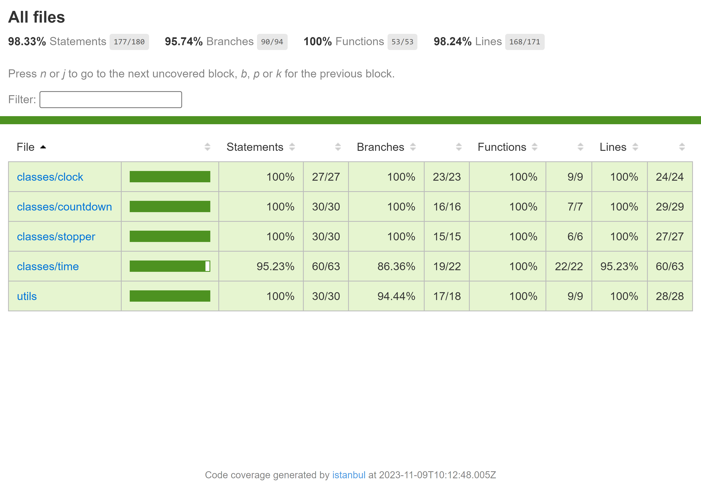

# Time Class Mastery

### This repository focuses on building a time class and expanding it to other classes like clock, countdown, and stopper. It serves as a platform for practicing JavaScript class implementation and exploring diverse time-related functionalities. 

---

#### This project primarily focuses on:

-   [x] **Classes** : implementing classes with methods, getters, and setters to incorporate the desired logic and functionality into the specified classes.
-   [x] **Inheritance** : inheriting from the time class in other classes such as clock, countdown and stopper preserved the initial time logic, reducing code duplication and ensuring easier maintenance.
-   [x] **Tests** : comprehensive test coverage for all functions, methods, classes, and utility functions to ensure their proper functionality and achieve full test coverage:  

---

#### This project was developed based on the instructions provided in my bootcamp program. For a more comprehensive understanding of the task, please refer to the "time-task.pdf" file included in the project. Kindly note that the document is written in Hebrew.

---

## Author

:octocat: **Afek Sakaju**

-   LinkedIn: [@afeksa](https://www.linkedin.com/in/afeksa/)
-   GitHub: [@Afek-Sakaju](https://github.com/Afek-Sakaju)
